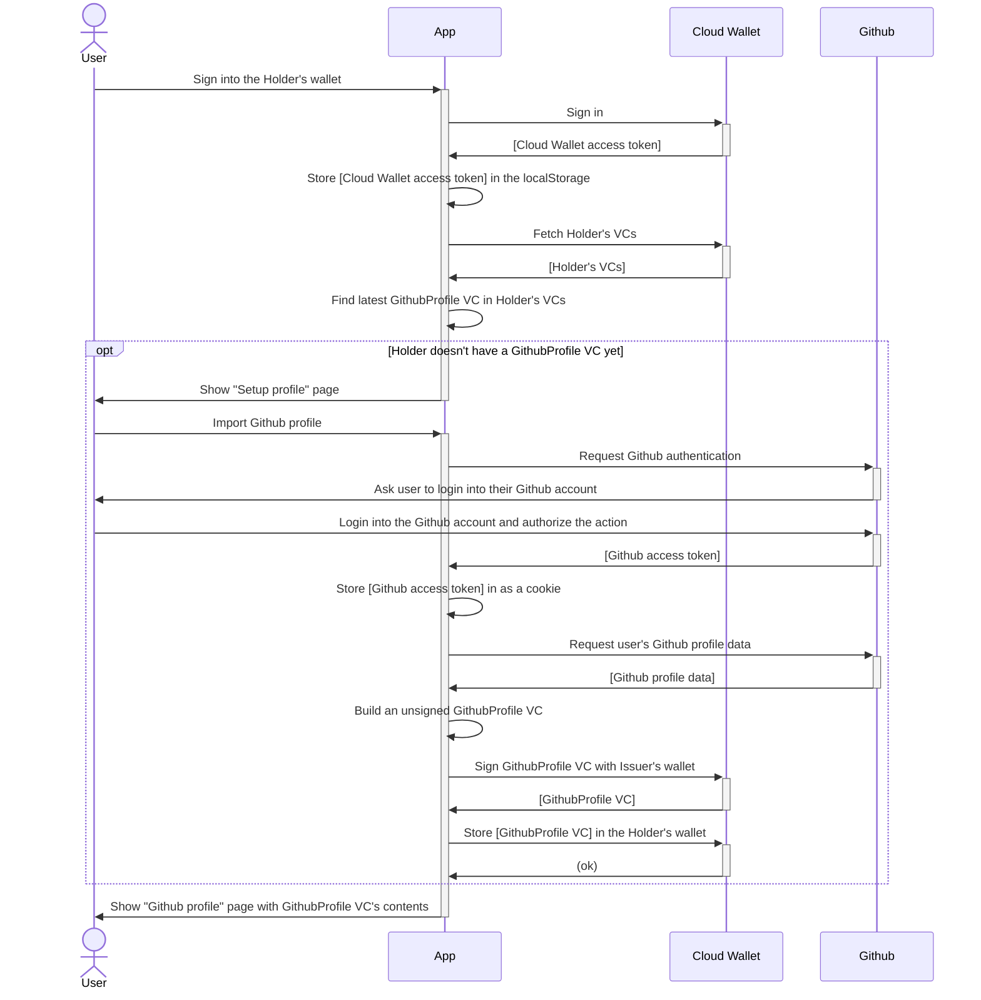

# Portable reputation – an Affinidi reference app

This is a ready-to-use reference app that showcases usage of Affinidi API for issuing, sharing and verifying credentials, as well as storing them in the wallet.

## Introduction


## Getting started

Setting up the reference app is easy, just follow these steps:  
1. Clone the repo:
    ```
    $ git clone git@github.com:affinidi/reference-app-portable-reputation.git
    $ cd reference-app-portable-reputation
    ```
2. Install the dependencies:
    ```
    $ npm install
    ```
3. Create a `.env` file:
    ```
    $ cp .env.example .env
    ```
    Please enter values for `PROJECT_ID`, `PROJECT_DID` and `API_KEY_HASH` from your project.  
    You also need to [create a Github OAuth app]((https://docs.github.com/en/developers/apps/building-oauth-apps/creating-an-oauth-app)) and enter values for `GITHUB_APP_CLIENT_ID` and `GITHUB_APP_CLIENT_SECRET`.
4. Launch the application:
    ```
    $ npm run dev
    ```
    App will be available locally on http://localhost:3000.

## Use case

### App flavours

### Terminology

### Overview diagram



## Tools & frameworks used

## Legal & FAQ
